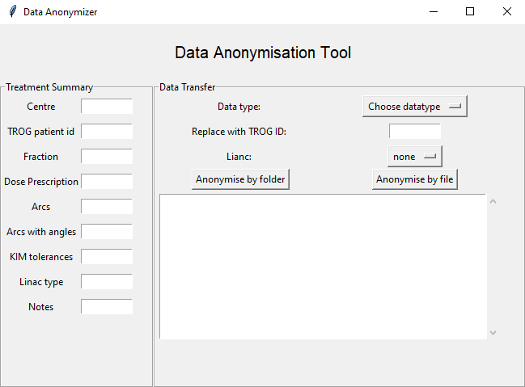
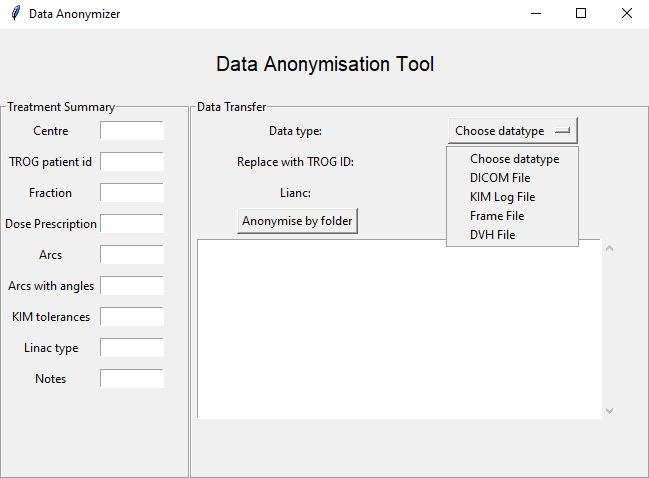
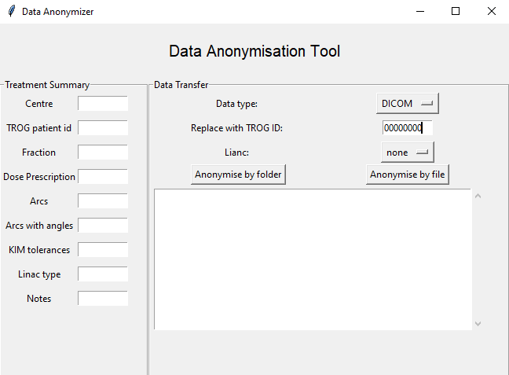
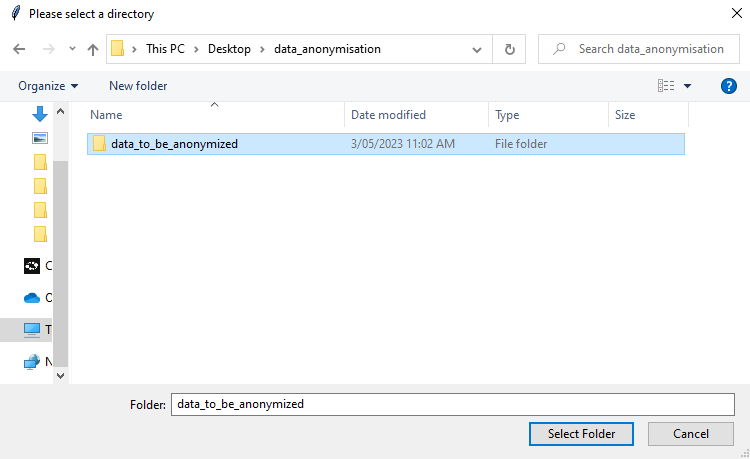
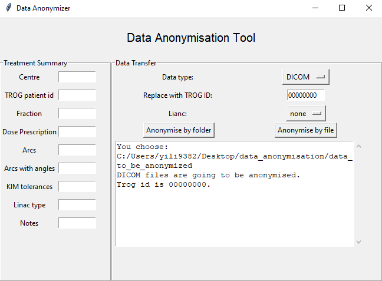

# Data_Anonymisation_Tool

This data anonymisation tool is for the de-identification of open-source RT data in different formats.

## What are these files

- interface.py is the main program to start a GUI. If you have python environment in their pc/laptop, you can run this file and start anonymisation.
- widgets.py contains all the widgets used in GUI and related functions the tool needs. If you want to add more functions, you can add the widgets here first and then then add the functions that the widget needs to call.
- dicom_anonymiser.py is to anonymise the DICOM files by reading the DICOM files header, replacing the patients’ information like ‘Patient’s Name’, ‘Patient ID’, ‘Patient’s Birth Date’, with TROG id or deleting other information like ‘Institution Name’. You can find more details in dicom_anonymisation_rules_default.json.
- dicom_anonymisation_rules_default.json is the rules of anonymising DICOM files , following the standards in https://wiki.cancerimagingarchive.net/display/Public/Submission+and+De-identification+Overview. To anonymise the DICOM files this rule should be in the same folder as interface.exe.
- frame_anonymiser.py is the function to anonymise the '_Frame.xml' files. This function read the tags of .xml files and replace the document in ‘FirstName’, ‘LastName’, ‘./Patient/ID’ with TROG ID. Also delete the documents with the tag ‘Description’.
- kimlog_anonymiser.py is the function to anonymise the KIM logs file by deleting the file paths. First It detects whether the file contains a 'Filename' object. It grabs all the ‘Filename’ information check if the file names include '.tiff' or ‘. hnd', then delete the file path part of the file name, which may contain the centre/patient information.
- dvh_anonymiser.py is the function to anonymise the .txt files with a ‘DVH’ in the file path. It browses the file and replaces the ‘Patient Name’ and ‘Patient ID’ information with TROG id.

## How to use this tool

1. Download this repo to your local drive. If you have a python environment, you can start by running the ‘interface.py’ in the code editor. If you don’t have a python environment or know python, please download the executable file in the Releases.

2. Choose the data type you want to anonymise by clicking ‘Data type’ button. For example, if you want to anonymise DICOM files, you can click 'Data type' and see a menu of all datatypes supported and choose 'Dicom'. The default text in the button is 'Choose a datatype'.

3. Input the TROG ID in the input box on the right of 'Replace with TROG ID'.

4. Click 'Anonymise by folder' then you can choose a folder and anonymise all files of the selected data type or click 'Anonymise by file' then can choose a single file to anonymise.

5. The textbox will output the result of anonymisation.

6. For acquisition files and KIM logs you don't need to input the TROG ID, it only deletes the certain information. But if you really want to input something in the input box, help yourself and it won’t affect the anonymisation result.
